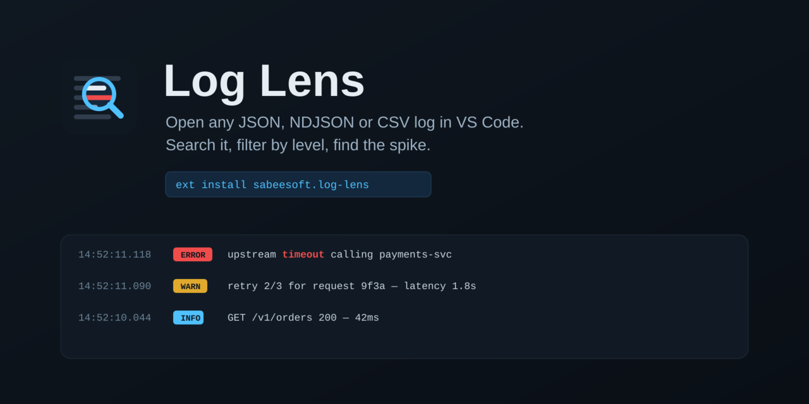
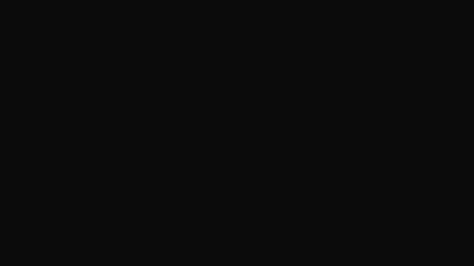

# Log Lens

A lightweight VS Code extension for reading and querying log files. Open any
**JSON**, **NDJSON** or **CSV** log, search it, filter by level, find the spike —
without leaving the editor. Log Lens follows your VS Code color theme (dark,
light and high contrast).

## Demo



## Opening logs

Log Lens never needs an active editor:

- **Activity Bar** → the **Log Lens** view → **Open Log File…**, plus your **recent** files
- **Explorer** → right-click a `.json`, `.log`, `.ndjson` or `.csv` file → **Open with Log Lens**
- **Command Palette** → `Log Lens: Open Log File…`, or load the file in the current
  editor with `Load Current JSON File`, `Load Log File (NDJSON)` or `Load CSV File`

While a Log Lens tab is focused, a **status bar** item shows the match count,
the number of parse errors (click to view them) and the detected format.

## Search and Query

Log Lens has two modes, toggled in the toolbar. The query text is the state:
level chips and column headers rewrite it.

### Search (default)

One input that matches the **message and every field** (nested values included).
Press **Enter** to run. **Level chips** (error / warn / info / debug / …) filter by
level and understand **numeric Pino/Bunyan levels** (`30` ≡ `info`).

### Query

A CloudWatch Logs Insights–style pipeline, prefilled from your current search so
nothing is lost:

```
fields @timestamp, level, message
| filter level = "error" and status >= 500
| sort @timestamp desc
| limit 100
```

- **`fields`** picks the columns (omit it, or `fields *`, to see the full raw rows).
  Clicking a **column header** sorts and rewrites the `| sort` line.
- **`filter`** supports `= != < <= > >=`, `like` (substring, or a `/regex/`), `in (...)`,
  `and` / `or` / `not`, grouping with `( )`, and bare terms for free-text search.
  `like` on an object field (e.g. a CloudWatch `@message` container) matches its
  JSON text, like a free-text search.
- In Query mode **Enter inserts a newline**; apply with **⌘/Ctrl + Enter** or **Run**.
  Typing never re-filters — it only applies when you run it.
- **Errors** are reported on Run with a **line/column**, a red squiggle under the
  offending token, and quick fixes: **“did you mean …?”** and **“comment out line N”**
  (`#` starts a line comment). Run is disabled while the query has errors.
- **Autocomplete** suggests fields (ranked so `level` surfaces `@message.level`) and
  keywords as you type.

## Volume histogram

A level-stacked histogram sits under the toolbar, bucketed from the detected
timestamp field — red for errors, yellow for warnings, blue for the rest — with
start / middle / end time labels, so you can see when things broke at a glance.

## The log table

- **Rows never wrap.** Object/array values render as a compact `{…} N keys` or
  `{…} N.N KB` badge (full value in the tooltip).
- **Level columns** are colour-coded and normalise numeric levels to names.
- Click a row to open the **details panel**.

## Details panel

- **Raw**, **Pretty** (syntax-highlighted) and **Tree** views.
- The tree collapses large values behind a single ▸ caret: objects/arrays show
  `{…} N keys`, long strings and stack traces truncate and expand in place — one
  affordance for everything.
- **↑ / ↓** step through rows while the panel is open.
- **Copy** the record, or **JSON TAB** to open the full record in a normal JSON
  editor for folding and search.
- Resizable, and overlays the list instead of pushing the layout.

## Filters panel

The **Filters** button opens a side panel with the structured controls:

- **Add filter** rows (contains / equals / > / < / regex / exists) combined with **AND / OR**
- **Order by** a field, ascending or descending
- **Visible fields** toggles and a **field depth** control for how deep nested keys are flattened

## Distributed traces

When trace fields are detected, a **SERVICE MAP** action opens a service graph:

- Service-to-service graph (React Flow + dagre) with healthy / warning / error nodes
- Click a node to filter logs by that service
- A resizable split between the graph and the trace’s logs
- Auto-detects `trace_id` / `traceId`, `span_id`, `parent_span_id`, `service` /
  `serviceName` / `service.name`, including when nested inside containers like
  `@message`, `message`, `data`, `body` or `payload` (AWS CloudWatch compatible)

## Supported formats

Log Lens reads three input formats and auto-detects the level and timestamp
fields from common shapes.

**JSON array** — a `.json` file containing an array of entries (objects or strings).

**NDJSON** — a `.log` / `.ndjson` file with one JSON object per line; malformed
lines are skipped and reported.

**CSV** — including AWS Athena / data-lake exports. Columns are auto-detected from
the header row, Unix epoch timestamps (seconds or milliseconds) are converted to
ISO 8601, and Java-style `{key=value, nested={…}}` notation is parsed into
structured objects (nested objects, arrays, booleans, nulls and numbers).

Common JSON shapes it handles:

```json
// Pino / Bunyan (numeric levels, epoch time)
{ "level": 30, "time": 1234567890, "msg": "Request received" }

// Winston
{ "level": "info", "message": "Server started", "timestamp": "2024-01-15T10:30:00.000Z" }

// AWS CloudWatch (nested @message container)
{
  "@timestamp": "2024-01-15T10:30:00.000Z",
  "@message": { "level": "info", "message": "Processing request", "service": "api-gateway" }
}
```

## Installation (from source)

```bash
git clone https://github.com/sabeesoft/log-lens.git
cd log-lens
npm run install:all     # install extension + webview deps
npm run build:webview   # build the React UI
```

Then open the folder in VS Code and press **F5** to launch the Extension
Development Host.

## Development

```
log-lens/
├── src/                        # Extension host (Node)
│   ├── extension.ts            # Commands, Activity Bar view, status bar
│   ├── fileLoader.ts           # Detect / parse / display a log file
│   ├── panels/
│   │   ├── LogLensPanel.ts     # Webview panel manager + messaging
│   │   └── LogLensStatusBar.ts # Status bar item
│   ├── parsers/                # csvParser, javaNotationParser, timestampUtils
│   ├── views/recentFiles.ts    # Recent-files tree view (globalState)
│   └── utilities/              # getNonce, getUri
├── webview-ui/                 # React UI (Vite)
│   └── src/
│       ├── components/         # QueryBar, QueryEditor, SearchBar, Histogram,
│       │                       # LogTable/LogList/LogRow, Sidebar, TraceModal, …
│       ├── lib/logql/          # LogQL tokenizer, parser, evaluator, serializer
│       ├── store/              # Zustand store
│       ├── hooks/ utils/ types # field discovery, mapping, helpers
└── assets/                     # icon + hero + logo sources
```

Scripts:

```bash
npm run install:all      # install all dependencies
npm run start:webview    # Vite dev server for the webview
npm run build:webview    # production build of the webview
npm run compile          # compile the extension TypeScript
npm run watch            # compile in watch mode
npm run lint             # lint the extension sources
```

Built with the VS Code Extension API, React 18, TypeScript, Zustand,
react-window, @xyflow/react + @dagrejs/dagre (service map), csv-parse, Vite and
Lucide icons. The query language is a small self-contained LogQL implementation
under `webview-ui/src/lib/logql`.

## Contributing

Contributions are welcome — please open an issue or a pull request.

## License

Licensed under the [Apache-2.0 License](LICENSE).

## Support

For bugs and feature requests, open an issue on the
[GitHub repository](https://github.com/sabeesoft/log-lens).
